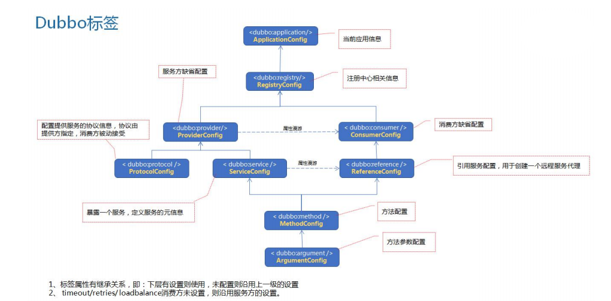
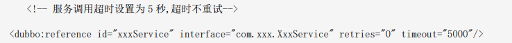

# Dubbo

## １.1 dubbo 的架构及特点

#####　 Dubbo整体结构

Dubbo 总体架构设计一共划分了 10 层，而最上面的 Service 层是留给实际想要使用 Dubbo 开发分布式服务的开发者实现业务逻辑的接口层。图中左边淡蓝背景的为服务消费方使用的接口，右边淡绿色背景的为服务提供方使用的接口，位于中轴线上的为双方都用到的接口。

## 1.2 角色关系

##### 节点角色说明

| 节点        | 角色说明                               |
| :---------- | :------------------------------------- |
| `Provider`  | 暴露服务的服务提供方                   |
| `Consumer`  | 调用远程服务的服务消费方               |
| `Registry`  | 服务注册与发现的注册中心               |
| `Monitor`   | 统计服务的调用次数和调用时间的监控中心 |
| `Container` | 服务运行容器                           |

##### 调用关系说明

0. 服务容器负责启动，加载，运行服务提供者。

1. 服务提供者在启动时，向注册中心注册自己提供的服务。
2. 服务消费者在启动时，向注册中心订阅自己所需的服务。
3. 注册中心返回服务提供者地址列表给消费者，如果有变更，注册中心将基于长连接推送变更数据给消费者。
4. 服务消费者，从提供者地址列表中，基于软负载均衡算法，选一台提供者进行调用，如果调用失败，再选另一台调用。
5. 服务消费者和提供者，在内存中累计调用次数和调用时间，定时每分钟发送一次统计数据到监控中心。

## 1.3 dubbo标签

 dubbo:service 服务配置，用于暴露一个服务，定义服务的元信息，一个服务可以用多个协议暴露，一个服务也可以注册到多个注册中心。
dubbo:reference 引用配置，用于创建一个远程服务代理，一个引用可以指向多个注册中心。
 dubbo:protocol 协议配置，用于配置提供服务的协议信息，协议由提供方指定，消费方被动接受。
dubbo:application 应用配置，用于配置当前应用信息，不管该应用是提供者还是消费者。
 dubbo:registry 注册中心配置，用于配置连接注册中心相关信息。
 dubbo:module 模块配置，用于配置当前模块信息，可选。
 dubbo:monitor 监控中心配置，用于配置连接监控中心相关信息，可选。
 dubbo:provider 提供方的缺省值，当 ProtocolConfig 和 ServiceConfig 某属性没有配置时，采用此缺省值，可选。
 dubbo:consumer 消费方缺省配置，当 ReferenceConfig 某属性没有配置时，采用此缺省值，可选。
 dubbo:method 方法配置，用于 ServiceConfig 和 ReferenceConfig 指定方法级的配置信息。
dubbo:method 用于指定方法参数配置。

>  **这5个配置是不可少的，前ApplicationConfig、ProtocolConfig 、 RegistryConfig、service、reference**
>

 ## 1.4 启动时检查

Dubbo 缺省会在启动时检查依赖的服务是否可用，不可用时会抛出异常，阻止 Spring 初始化完成，以便上线时，能及早发现问题，默认 check="true"可以通过 check="false"关闭检查，比如，测试时，有些服务不关心，或者出现了循环依赖，必须有一方先启动

另外，如果你的 Spring 容器是懒加载的，或者通过 API 编程延迟引用服务，请关闭 check，否则服务临时不可用时，会抛出异常，拿到 null 引用，如果
 check="false"，总是会返回引用，当服务恢复时，能自动连上

 关闭某个服务的启动时检查（没有提供者时报错）：

 关闭所有服务的启动时检查（没有提供者时报错）：

 关闭注册中心启动时检查（注册订阅失败时报错）：

## 1.5 Dubbo 超时重连

**超时**

Dubbo 消费端在发出请求后，需要有一个临界时间界限来判断服务端是否正常。这样消费端达到超
时时间，那么 Dubbo 会进行重试机制，不合理的重试在一些特殊的业务场景下可能会引发很多问题，
需要合理设置接口超时时间
Dubbo 超时和重试配置示例：

**重连**

Dubbo 在调用服务不成功时，默认会重试 2 次
Dubbo 的路由机制，会把超时的请求路由到其他机器上，而不是本机尝试，所以 Dubbo 的重试机制也能一定程度的保证服务的质量